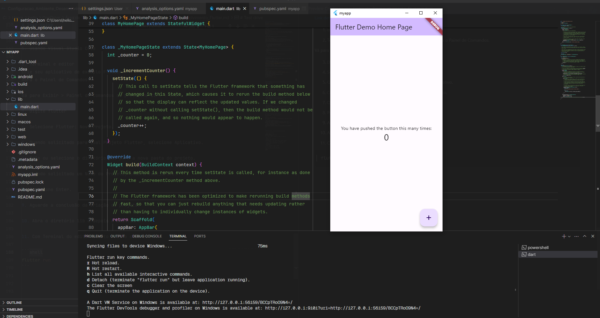

# 🛠️ Ambiente de desenvolvimento

Ambiente de configuração de desenvolvimento e testes de integração no Flutter

<!-- e a execução no Firebase Test Lab e também a automatização via Github Actions (new)-->

## Índice de Conteúdo

- [Instalação do SDK Flutter](#instalação-do-sdk-flutter) <br>
- [Configuração de Variáveis do Flutter](#configuração-de-variáveis-de-ambiente-flutter) <br>
- [Instalação da IDE Android Studio](#ide-android-studio) <br>
- [Configuração do SDK Dart](#configuração-de-variáveis-de-ambiente-dart) <br>
- [Check List](#✔️-check-list) <br>
- [Test drive](#🏗️-test-drive) <br>

## Requisitos

```markdown
- SDK : Flutter (Variáveis de ambiente configuradas)
- SDK : Dart (Variáveis de ambiente configuradas)
- IDE : Android Studio ou VSCODE (plugins)
```

_Recomenda-se utilizar o VS Code como IDE devido à sua flexibilidade, facilidade de instalação e curva de aprendizado menor._

# Instalação do SDK Flutter

1. link:
   [Começar](https://docs.flutter.dev/get-started/install/windows/mobile?tab=download#install-the-flutter-sdk)

2. Caso use outra plataforma
   [Outras Patafromas/Linux](https://docs.flutter.dev/get-started/install)
3. Baixe o pacote de SDK do Flutter de seu arquivo, mova o pacote para onde deseja armazená-lo e depois extraia o SDK.
   [flutter_windows_3.19.3-stable.zip](https://storage.googleapis.com/flutter_infra_release/releases/stable/windows/flutter_windows_3.19.3-stable.zip)
4. Crie uma pasta onde você possa instalar o Flutter.
   _Recomendo que seja instalado no diretório_ `C:\` <br>
5. Crie uma pasta renomeada dev no diretório `C:\`<br>
   _Ficando assim:_<br>
   ```shell
       C:\
       └── dev
   ```
6. Iremos extrair o arquivo zipado **flutter_windows_3.19.3-stable.zip** dentro da pasta **dev** <br>
   _agora temos a seguinte estrutrura:_<br>
   ```shell
   C:\
   └── dev
       └── flutter
   ```
7. Done ✅

- agora vamos para configuração de Variáveis de ambiente

<br>

# Configuração de Variáveis de Ambiente **Flutter**

_Configurando o PATH
   Para que o Flutter seja acessível globalmente em seu sistema, você precisa adicionar o diretório de instalação do Flutter ao seu PATH._

## No Windows:

1. digite no menu de pesquisa do win `env`.
2. depois Clique em "Variáveis de Ambiente".
3. Em "Variáveis do Sistema", procure pela variável Path e selecione "Editar".
   Clique em "Novo" e adicione o caminho para o diretório bin do Flutter. Por exemplo, se você instalou o Flutter em `C:\dev\flutter `, adicione `C:\dev\flutter\bin`
4. Clique em "OK" para fechar todas as janelas.
5. Verificando a Configuração
   Após configurar as variáveis de ambiente, abra um novo terminal ou prompt de comando e execute o seguinte comando para verificar se tudo está configurado corretamente:

```bash
flutter --version
```

Se tudo estiver configurado corretamente, você verá uma saída indicando que o Flutter está pronto para uso.

```bash
Flutter 3.19.3 • channel stable • https://github.com/flutter/flutter.git
Framework • revision ba39319843 (13 days ago) • 2024-03-07 15:22:21 -0600
Engine • revision 2e4ba9c6fb
Tools • Dart 3.3.1 • DevTools 2.31.1
```

<br>

# IDE Android Studio


1. Faça o download: [Link](https://redirector.gvt1.com/edgedl/android/studio/install/2023.2.1.23/android-studio-2023.2.1.23-windows.exe)
2. Realize a instalação padrão no Windows.


## No Android Studio, há algumas configurações adicionais simples para serem feitas <br>
_Iremos criar um dispositivo_

1. Abra o Android Studio
2. Menu superior

```
- Tools >
   └──Device Manager >
                  └──Create device
```

3. Crie um dispositivo caso esteja vazia.

<br>

# Configuração de Variáveis de Ambiente **Dart**

_Onde instamos o flutter tambem temos o sdk do Dart
ficando no diretório_

```bash
C:\dev\flutter\bin\cache\dart-sdk
```

para adicionamos o dart em Variáveis de Ambiente segueremos a mesma logica que fizemos para o Flutter

1. digite no menu de pesquisa do win `env`.
2. depois Clique em "Variáveis de Ambiente".
3. Em "Variáveis do Sistema", procure pela variável Path e selecione "Editar".
   Clique em "Novo" e adicione o caminho para o diretório bin do dart. <br>
   Por exemplo, se você instalou o Flutter em `C:\dev\flutter` <br> vai está em: `C:\dev\flutter\bin\cache\dart-sdk\bin`
4. Clique em "OK" para fechar todas as janelas.
5. Verificando a Configuração
   Após configurar as variáveis de ambiente, abra um novo terminal ou prompt de comando __CMD__ e execute o seguinte comando para verificar se tudo está configurado corretamente:

```cmd
dart -v
```

<br>

# ✔️ Check List

No seu terminal, execute o script:

```bash
C\> flutter doctor
```

#### ❌ Caso ocorra um erro ao executar `flutter doctor`

Também é comum de ocorrer erros com o `Android SDK Command-line Tools` e o `flutter doctor --android-licenses.`
Se ocorrer algum problema, siga estes procedimentos:

## Para solucionar o Android SDK Command-line Tools faça:

#### [pt-BR]

Assim como você, tenho o Android Studio instalado. A chave é instalar as **Ferramentas de Linha de Comando do Android SDK**, seguindo estes passos:

1. Abra o Android Studio
2. Menu Ferramentas, Gerenciador SDK
3. Na janela que aparece, há painéis internos, escolha o painel **Ferramentas SDK**
4. Marque a opção **Ferramentas de Linha de Comando do Android SDK**
5. Escolha o botão **Aplicar** perto do fundo da janela
6. Execute os comandos novamente para verificar se está tudo ok

```shell
flutter doctor
```

#### [en-US]

Just like you, I have Android Studio installed, the key is to install **Android SDK Command-line Tools**, steps being:

1. Open Android Studio
2. Tools Menu, SDK Manager
3. In the window that comes up there are inner panels, choose **SDK Tools** panel
4. Tick **Android SDK Command-line Tools**
5. Choose **Apply** button near the bottom of the window
6. And run the commands again to verify if everything is okay.

```shell
flutter doctor
```

---

### Após instalar o Android SDK Command-line Tools, rode o script:

```shell
flutter doctor --android-licenses
```

### Execute os comandos novamente para verificar se está tudo ok

```shell
flutter doctor
```


<br>

# 🏗️ Test drive

[Link detalhado](https://docs.flutter.dev/get-started/test-drive)

1. Usando Visual Studio Code [Instale a extensão recomendada do Flutter](https://marketplace.visualstudio.com/items?itemName=Dart-Code.flutter)

2. Terminal e editor
   Crie seu aplicativo de exemplo Flutter
   Abra o Painel de Comandos.

Vá para Exibir > Painel de Comandos ou pressione Ctrl + Shift + P.

3. Digite flutter

4. Selecione Flutter: Novo Projeto.

5. Quando solicitado para Qual Projeto Flutter, selecione Aplicativo.

6. Crie ou selecione o diretório pai para a nova pasta do projeto.

7. Quando solicitado um Nome do Projeto, insira test_drive.

8. Pressione Enter.

9. Aguarde a conclusão da criação do projeto.

10. Abra o diretório lib e depois o main.dart

11. Com Terminal do editor aberto rode o comando

12. Caso o seu emulador não esteja ligado, execute o seguinte comando:
```shell
Para iniciar um emulador, utilize 'flutter emulators --launch <id_do_emulador>'.
```
13. Após conectar o emulador, execute o comando:
```shell
flutter run
```

14. Selecione uma das opções

Tela final do test-drive:


# Feedback e Perguntas

Então agradeceria seu feedback e perguntas sobre a documentação do projeto. Suas observações me ajudarão a melhorar minhas habilidades.
